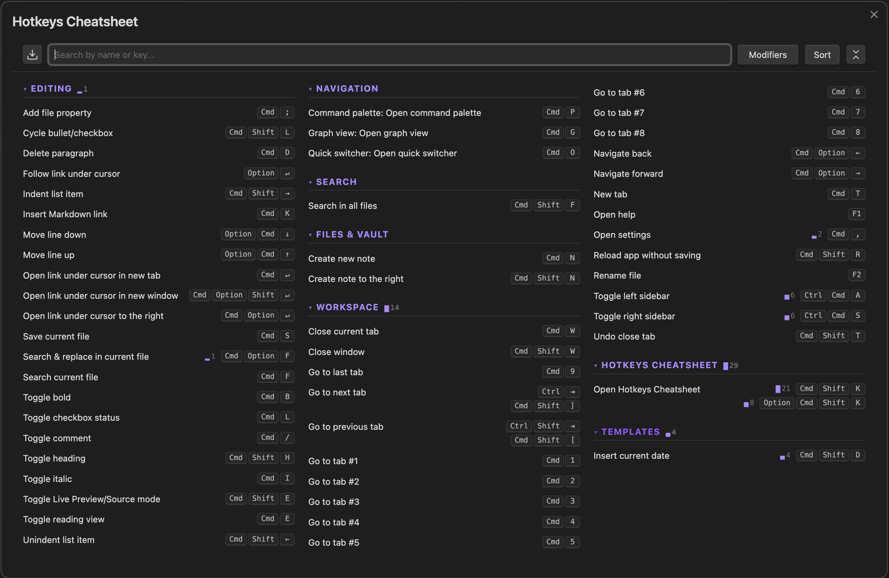

# Hotkeys Cheatsheet

A live, searchable reference card for all your Obsidian keyboard shortcuts — opened instantly from the ribbon or command palette.

## What it does

Obsidian's built-in hotkey settings show a flat alphabetical list of 250+ commands. This plugin gives you a visual overview instead: a newspaper-style multi-column layout with every shortcut you have assigned, complete with `Cmd`, `Shift`, `Option`, `Ctrl` key badges rendered for your OS.



### Features

- **Live data** — reads your actual keymap at runtime (default hotkeys + your custom overrides), so it always reflects what's really assigned
- **Newspaper-style columns** — content flows top-to-bottom within each column then spills right; scroll horizontally to see more columns, or vertically on narrow viewports
- **Categorised sections** — core commands grouped by workflow (Editing, Navigation, Search, Files & Vault, Workspace); community plugin commands grouped by plugin name
- **Collapsible sections** — click any category heading to collapse or expand it; collapse/expand all with the icon button in the toolbar
- **Real-time search** — filter by command name or key character (type `b` to find all `Cmd B`, `Cmd Shift B`, etc.); collapsed sections auto-expand while searching and restore when cleared
- **Search clear button** — `×` button inside the search field clears the query instantly
- **Modifier filter** — dropdown to show only hotkeys that include specific modifiers (AND logic: select Cmd + Shift to find all `Cmd Shift` combos)
- **Modifier filter chips** — active modifier filters are shown directly on the filter button as flat `<kbd>` chips
- **Export menu** — toolbar export dropdown lets you save the cheatsheet as a note or export it as HTML
- **OS-aware badges** — `Cmd`/`Option` on macOS, `Ctrl`/`Alt`/`Win` on Windows/Linux
- **Special key icons** — arrow keys show ↑↓←→, Enter shows ↵, Backspace shows ⌫, Tab shows ⇥, etc.
- **Theme-compatible** — uses Obsidian CSS variables, works with any light or dark theme
- **Ribbon toggle** — hide or show the ribbon icon from Settings; the command palette entry always remains available
- **Header close button** — close the modal with the `✕` button in the header

### How to open it

- Click the keyboard icon in the ribbon (left sidebar)
- Or run **Open Hotkeys Cheatsheet** from the command palette (`Cmd P`)

### Keyboard behaviour

| Key | Action |
|-----|--------|
| `Escape` (search active) | Clears the search input and restores pre-search collapse state |
| `Escape` (search empty) | Closes the modal |

### Export options

Use the **Export** button in the modal toolbar to save the current cheatsheet in either format:

- **Save as Note** — creates an Obsidian note version of the cheatsheet
- **Save as HTML** — exports the cheatsheet as an HTML file

---

## Settings

Open **Settings → Hotkeys Cheatsheet** to configure:

| Setting | Default | Description |
|---------|---------|-------------|
| Show ribbon icon | On | Toggles whether the keyboard icon appears in the ribbon on startup. If disabled, the command palette entry still opens the cheatsheet. |

---

## Development

### Prerequisites

- Node.js ≥ 18
- An Obsidian vault for testing

### Setup

```bash
# Install dependencies
npm install

# Copy .env.example and set your vault plugin path
cp .env.example .env
```

### Scripts

```bash
# Production build → dist/main.js
npm run build

# Development build (sourcemaps, watch mode)
npm run dev

# Copy dist/ to your local vault plugin directory
npm run deploy

# Build + deploy in one step
npm run dev:deploy

# Remove dist/
npm run clean
```

### Project structure

```text
src/
├── ts/
│   ├── main.ts              Plugin entry point — ribbon icon, command, ribbon visibility setting
│   ├── settingsTab.ts       Settings tab — ribbon toggle and about blurb
│   ├── cheatsheetModal.ts   Modal UI — columns, search, collapse, modifier filter, kbd badges
│   ├── hotkeyCollector.ts   Data layer — merges defaultKeys + customKeys, categorises, sorts
│   ├── categories.ts        Curated prefix → category map and display order
│   ├── i18n.ts              Locale detection and t() helper
│   └── i18n/
│       ├── en.json          English strings
│       ├── fr.json          French strings
│       └── es.json          Spanish strings
└── css/
    └── styles.css           All plugin styles (Obsidian CSS vars, no hardcoded colours)
```

### How hotkey data is collected

Obsidian exposes two internal maps on `app.hotkeyManager`:

```ts
app.hotkeyManager.defaultKeys  // Record<commandId, Hotkey[]> — Obsidian built-in defaults
app.hotkeyManager.customKeys   // Record<commandId, Hotkey[]> — user overrides
```

These are undocumented internal properties. A runtime guard checks for their existence and emits a console warning if they're missing (future-proofing against API changes).

Merge rule: if a command ID exists in `customKeys`, use those hotkeys (even `[]` — meaning the user cleared the default); otherwise fall back to `defaultKeys`.

> **Why not `getHotkeys(id)`?** It returns only user overrides, missing all built-in defaults (~41 hotkeys in a standard vault).

### Categorisation

Commands are categorised using a hybrid strategy:

1. If the command ID prefix (before the first `:`) matches a curated map → use the mapped workflow category
2. If the prefix is unknown → title-case it as a plugin group name
3. If there is no `:` in the ID → parse the display name for a `"PluginName: …"` pattern; fall back to "Other"

Core category order: Editing → Navigation → Search → Files & Vault → Workspace → (plugin groups, alphabetical)

### Localisation

The plugin UI is available in **English** (default), **French**, and **Spanish**. Language is detected automatically from Obsidian's locale setting.

To add a new language:

1. Copy `src/ts/i18n/en.json` to `src/ts/i18n/<code>.json` (e.g. `de.json`)
2. Translate all values — keys must stay identical to `en.json`
3. Import and register it in `src/ts/i18n.ts`:
   ```ts
   import de from "./i18n/de.json";
   const locales = { en, fr, es, de };
   ```
4. Rebuild: `npm run build`

### Releases

1. **Bump the version** — choose `patch`, `minor`, or `major`:

   ```bash
   npm run release:prepare patch
   ```

   Updates `package.json` and `manifest.json`, then commits both as `"chore: bump version to X.Y.Z"`.

2. **Make your code changes** and commit them:

   ```bash
   git add -A && git commit -m "feat: ..."
   ```

3. **Publish** — pushes the branch, creates a bare version tag (e.g. `1.1.6`), and pushes the tag:

   ```bash
   npm run release
   ```

   The tag push triggers the GitHub Actions workflow, which builds and publishes the release.
